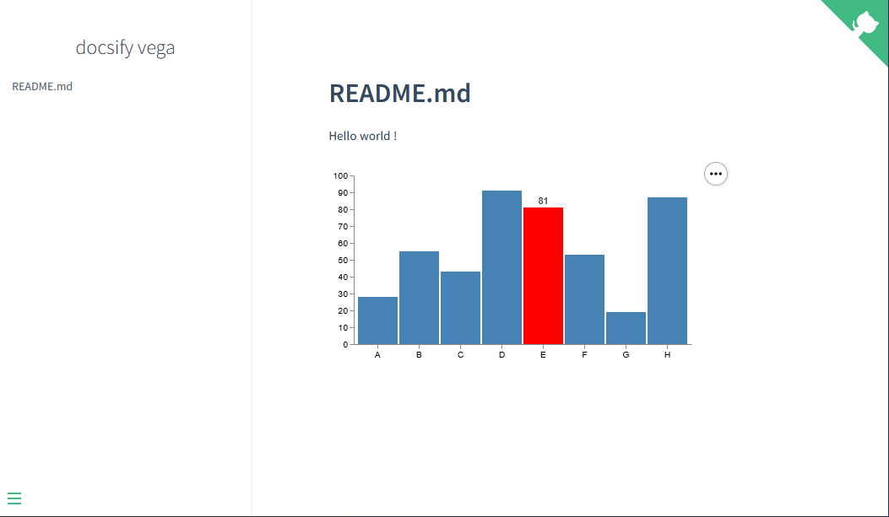
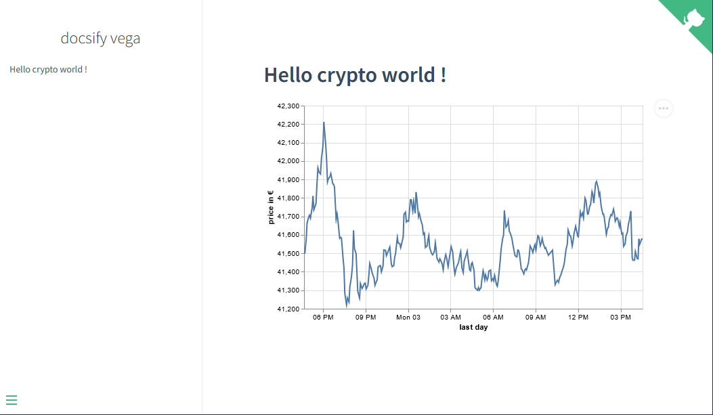

# Comment afficher le cours d'une crypto sur sa page github ?

Derrière ce titre racoleur, se cache un article sur la création d'un site statique affichant un diagramme (le cours d'une crypto).

## Docsify c'est quoi ?

La publication de sites statiques est de plus en plus à la mode, car leur mise en œuvre est souvent facile et que le langage de rédaction est basique.
Plusieurs outils se partagent l'affiche : [Jekyll](https://jekyllrb.com/), [Hugo](https://gohugo.io/) ... J'en ai choisi un autre : [Docsify](https://docsify.js.org).
Il a comme avantage de prendre en entrée du markdown ( [j'aime le markdown](https://medium.com/@jerome.carre/au-rapport-chef-f186726a7de8) ) et surtout de le traiter en l'état, il ne fait pas de transformation préalable en HTML. 

L'installation de docsify se résume à déposer un fichier index.html et un fichier de contenu README.md à la racine du site :

```html
<!DOCTYPE html>
<html>
<head>
  <meta http-equiv="X-UA-Compatible" content="IE=edge,chrome=1">
  <meta name="viewport" content="width=device-width,initial-scale=1">
  <meta charset="UTF-8">
  <link rel="stylesheet" href="//cdn.jsdelivr.net/npm/docsify@4/themes/vue.css" />
</head>
<body>
  <div id="app"></div>
  <script>
    window.$docsify = {
      name: 'docsify vega',
      repo: 'https://github.com/jerCarre/docsify_vega',
    }
  </script>
  <script src="//cdn.jsdelivr.net/npm/docsify@4"></script>
</body>
</html>
```

```markdown
# README.md

Hello world !

```

## Pages dans Github

Github propose gratuitement le service Pages pour héberger un site statique reposant sur du HTML, CSS, Javascript. Il fournit aussi une URL pour accéder à ce site.

Pour utiliser Pages, il suffit : 
1. de créer un repo **public**
2. d'aller dans ```Settings->Pages```
3. de choisir la branche hébergeant votre site
4. d'indiquer le chemin vers index.html de docsify. 

En retour Github vous indiquera l'URL d'accès. 

Après quelques secondes, votre site est en ligne !!


Nous aurons donc les fichiers suivants dans notre repo : 

```text
.
└── /
    ├── index.html
    └── README.md
```

## Vega-Lite forever

[Vega](https://vega.github.io/vega/) est une library javascript permettant d'afficher des diagrammes (courbes, nuages de points, camembert, cartes, ...) . Elle se base sur une grammaire au format json. [Vega-Lite](https://vega.github.io/vega-lite/) est une version allégée de Vega. Vega/Vega-Lite a l'avantage de ne nécessiter que quelques imports pour fonctionner. Vega est prévu pour être embarqué dans d'autres outils. 

Un aperçu de ce que l'on peut dessiner avec dans [ce précédent article](https://medium.com/@jerome.carre/au-rapport-chef-f186726a7de8).

### Vega-Lite et docsify

Docsify permet d'afficher des diagrammes au format Mermaid, pour en intégrer d'autres il faut utiliser des plugins. Aucun plugin n'étant recensé sur [cette page](https://docsify.js.org/#/awesome?id=plugins), j'en ai donc développé un pour Vega/Vega-Lite. Son utilisation est décrite ici https://jercarre.github.io/vega_docsify/#/ 

On a donc notre fichier index.html :

```html
<!DOCTYPE html>
<html>
<head>
  <meta http-equiv="X-UA-Compatible" content="IE=edge,chrome=1">
  <meta name="viewport" content="width=device-width,initial-scale=1">
  <meta charset="UTF-8">
  <link rel="stylesheet" href="//cdn.jsdelivr.net/npm/docsify@4/themes/vue.css" />
</head>
<body>
  <div id="app"></div>
  <script>
    window.$docsify = {
      name: 'docsify vega',
      repo: 'https://github.com/jerCarre/docsify_vega',
    }
  </script>
  <script src="//cdn.jsdelivr.net/npm/docsify@4"></script>
  
  <script src="//cdn.jsdelivr.net/npm/vega@5"></script>
  <script src="//cdn.jsdelivr.net/npm/vega-lite@5"></script>
  <script src="//cdn.jsdelivr.net/npm/vega-embed@6"></script>
  <script src="//cdn.jsdelivr.net/gh/jerCarre/vega_docsify@v1.1/lib/docsivega.js"></script>
  
</body>
</html>
```

et le README.md

````markdown
# Hello world !

```vega
https://raw.githubusercontent.com/vega/vega/master/docs/examples/bar-chart.vg.json
```

````

Pour obtenir :



### Une crypto dans Vega-Lite

Vega/Vega-Lite a aussi l'avantage de pouvoir lire ses données depuis une API. Mais il faut que cette API s'autosuffise et soit en GET car on ne peut pas préciser de header. Après quelques recherches j'ai trouvé coingecko qui permet d'avoir le cours d'une crypto sur les X derniers jours. De plus cette api ne nécessite pas de token, elle est publique.

Pour avoir le cours du bitcoin depuis 24h, on peut donc appeler : https://api.coingecko.com/api/v3/coins/bitcoin/market_chart?vs_currency=eur&days=1 

et avoir (en raccourci) : 
```json
{"prices":[[1641137007567,41637.83411713587],[1641137244268,41579.072842123],[1641137476057,41578.04595490743],[1641137952530,41504.83017220277],[1641138178298,41502.722548713165],[1641138490632,41572.95862016224],[1641138725476,41664.34163465742],[1641139126440,41696.036160482596],[1641139324313,41706.24565959366],[1641139579229,41690.04405619627],[1641140038186,41750.43550340376],[1641140229278,41811.27689166205],[1641140453839,41735.801954558665],[1641140998579,41769.16264562593]]}
```

> L'élément [0] est le temps (epoch), le [1] est la valeur en €

Plus qu'à mettre ça dans un diagramme :

````markdown
# Hello Crypto world !

```vegalite
{
  "$schema": "https://vega.github.io/schema/vega-lite/v5.json",
  "description": "Bitcoin/eur last day evolution",
  "width": 500,
  "height": 300,
  "data": {
    "format": {"type": "json", "property": "prices"},
    "url": "https://api.coingecko.com/api/v3/coins/bitcoin/market_chart?vs_currency=eur&days=1"
  },
  "mark": "line",
  "encoding": {
    "x": {
      "field": "0", 
      "type": "temporal", 
      "axis": {"title": "last day"}
    },
    "y": {
      "field": "1",
      "type": "quantitative",
      "scale": {"zero": false},
      "axis": {"title": "price in €"}
    }    
  }
}
```

````



## et pour finir ...

On peut enrichir le diagramme avec des réglettes qui se déplacent avec la souris sur la courbe. Aussi la valeur derniere valeie sera affichée en haut à droite.

```vegalite
{
    "$schema": "https://vega.github.io/schema/vega-lite/v5.json",
    "description": "Bitcoin/eur last day evolution",
    "width": 500,
    "height": 300,
    "data": {
      "format": {"type": "json", "property": "prices"},
      "url": "https://api.coingecko.com/api/v3/coins/bitcoin/market_chart?vs_currency=eur&days=1"
    },
    "encoding": {"x": {"field": "0", "type": "temporal", "axis": {"title": "last day"}}},
    "layer": [
      {
        "layer": [
          {"mark": "line"},
          {
            "transform": [{"filter": {"param": "hover", "empty": false}}],
            "mark": "point"
          }
        ],
        "encoding": {
          "y": {"field": "1", "type": "quantitative", "scale": {"zero": false}, "axis": {"title": "price in €"}}
        }
      },
      {
        "mark": "rule",
        "encoding": {
          "opacity": {
            "condition": {"value": 0.3, "param": "hover", "empty": false},
            "value": 0
          },
          "tooltip": [{"field": "1", "title": "price"}]
        },
        "params": [
          {
            "name": "hover",
            "select": {
              "type": "point",
              "fields": ["0"],
              "nearest": true,
              "on": "mouseover",
              "clear": "mouseout"
            }
          }
        ]
      }
    ]
  }
```
Avec ces même données on pourrait aussi afficher par exemple la distribution des prix :
