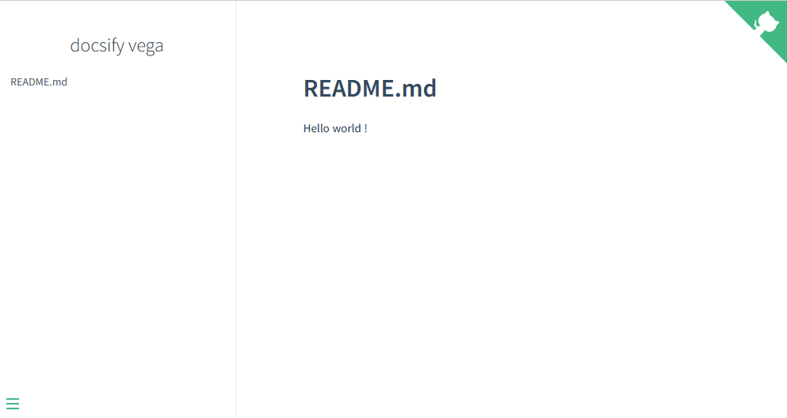

# Comment afficher le cours d'une crypto sur sa page github ?

Derriere ce titre racoleur, se cache un article détaillant la création dans github d'un site statique affichant un diagramme (le cours d'une crypto).

## Docsify c'est quoi ?

La publication de sites statiques est de plus en plus à la mode, car leur mise en oeuvre est souvent facile et que le language de rédaction est basique.
Plusieurs outils se partagent l'affiche : [Jekyll](https://jekyllrb.com/), [Hugo](https://gohugo.io/) ... J'en est choisi un autre : [Docsify](https://docsify.js.org).
Il a comme avantage de prendre en entrée du markdown (et vous savez que [j'aime le markdown](https://medium.com/@jerome.carre/au-rapport-chef-f186726a7de8)) et surtout de le traiter en l'état, il ne fait pas de transformation préalable en HTML. 

L'installation de docsify se résume à déposer un fichier index.html et un fichier de contenu README.md à la racine du site :

```html
<!DOCTYPE html>
<html>
<head>
  <meta http-equiv="X-UA-Compatible" content="IE=edge,chrome=1">
  <meta name="viewport" content="width=device-width,initial-scale=1">
  <meta charset="UTF-8">
  <link rel="stylesheet" href="//cdn.jsdelivr.net/npm/docsify@4/themes/vue.css" />
</head>
<body>
  <div id="app"></div>
  <script>
    window.$docsify = {
      name: 'docsify vega',
      repo: 'https://github.com/jerCarre/docsify_vega',
    }
  </script>
  <script src="//cdn.jsdelivr.net/npm/docsify@4"></script>
</body>
</html>
```

```markdown
# README.md

Hello world !

```

## Pages dans Github

Github propose gratuitement le service Pages pour héberger un site statique reposant sur du HTML, CSS, Javascript. Il fournit aussi une URL pour accéder à votre site.

Pour utiliser pages, il suffit de créer un repo **public** puis d'aller dans ```Settings->Pages``` et enfin de choisir la branche hébergeant votre html ainsi que le chemin vers index.html de docsify. En retour Github vous indique l'URL d'accès. 

Après quelques secondes, votre site est en ligne !!



!> Github pages préconise d'utiliser Jekyll pour générer votre site, puisque nous ne voulons pas l'utiliser, nous ajouterons un fichier nommé ".nojekyll" à la racine du site.

Nous aurons donc les fichiers suivants dans notre repo : 

```shell
.nojekyll
index.html
README.md
```

## Vegalite forever

## ... et voila !

```vegalite
{
    "$schema": "https://vega.github.io/schema/vega-lite/v5.json",
    "description": "Bitcoin/eur last day evolution",
    "width": 500,
    "height": 300,
    "data": {
      "format": {"type": "json", "property": "prices"},
      "url": "https://api.coingecko.com/api/v3/coins/bitcoin/market_chart?vs_currency=eur&days=1"
    },
    "encoding": {"x": {"field": "0", "type": "temporal", "axis": {"title": "last day"}}},
    "layer": [
      {
        "layer": [
          {"mark": "line"},
          {
            "transform": [{"filter": {"param": "hover", "empty": false}}],
            "mark": "point"
          }
        ],
        "encoding": {
          "y": {"field": "1", "type": "quantitative", "scale": {"zero": false}, "axis": {"title": "price in €"}}
        }
      },
      {
        "mark": "rule",
        "encoding": {
          "opacity": {
            "condition": {"value": 0.3, "param": "hover", "empty": false},
            "value": 0
          },
          "tooltip": [{"field": "1", "title": "price"}]
        },
        "params": [
          {
            "name": "hover",
            "select": {
              "type": "point",
              "fields": ["0"],
              "nearest": true,
              "on": "mouseover",
              "clear": "mouseout"
            }
          }
        ]
      }
    ]
  }
```
